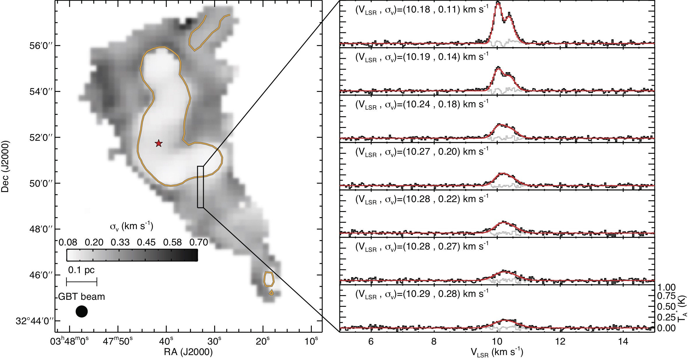

**Dense Cores.** Structure, coherence, and fragmentation in star-forming cores.

**Streamers.** Accretion flows and streamer-fed protostellar growth.

**Disks Around YSOs.** Disk structure, chemistry, and early planet-forming environments around young stars.

**Large Programs.**

- ProPStar (pilot program at IRAM)
- ProPStarK &mdash; [website](https://propstark.github.io/)
- GAS &mdash; [survey page](https://greenbankobservatory.org/science/gbt-surveys/gas/) &middot; [GitHub repository](https://github.com/GBTAmmoniaSurvey)
